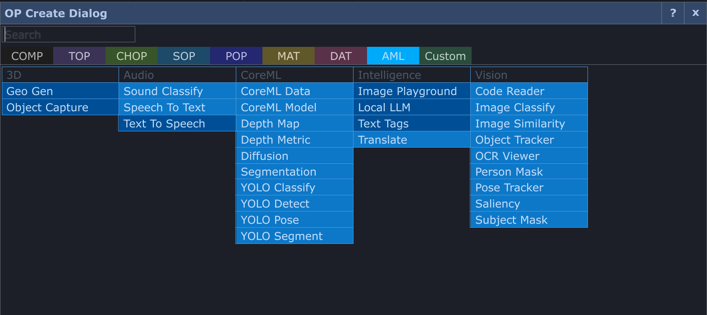
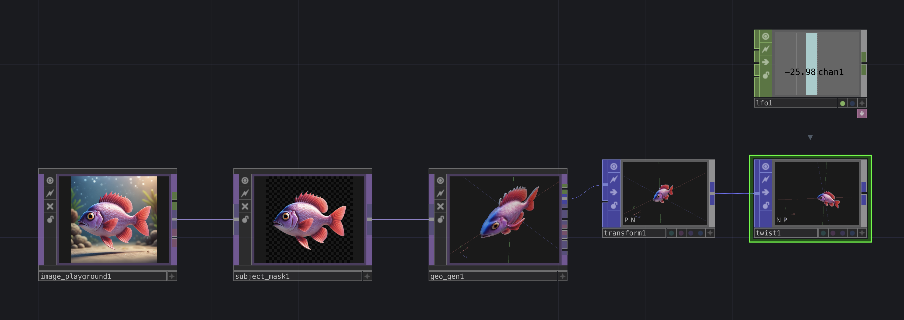

# AML — Apple Machine Learning operators for TouchDesigner

A family of native TouchDesigner operators that wrap Apple's own machine
learning — Vision, Core ML, Speech, Apple Intelligence — as operators you
drag into a network.

Everything runs on your Mac. No Python environment, no cloud service, no API
keys, and nothing leaves the machine.

**Requirements:** an Apple Silicon Mac, macOS 12 or newer, TouchDesigner
2023.12000 or newer. A few operators need a newer macOS and say so on the
node.

---

## What this repository is for

**Documentation and issue reporting.** AML itself is not distributed here.

- **[Operator reference](docs/README.md)** — one page per operator: what it
  does, what to wire in, what comes out, every parameter, and the extension
  and callbacks where an operator has them.
- **[Getting started](docs/getting-started.md)** — install, first operator,
  where models live.
- **[Model Manager](docs/model-manager.md)** — which operators need a
  download, where models are stored, and what each licence means.
- **[Troubleshooting](docs/troubleshooting.md)** — the things that actually
  go wrong, and what to do about them.

Found a bug or want to request something? **[Open an
issue](../../issues/new/choose).**

---

## Why native?

Most ML toolkits for TouchDesigner run their models *next to* TD — in an
embedded browser, a Python process, or an
external app — and stream results back over WebSockets or shared memory.
That works, but adds latency. AML calls the macOS ML
stack **in-process**:

- **Zero transport.** Results are TouchDesigner channels and tables the
  moment inference ends — no socket hop, no JSON serialization, no
  browser compositor in the loop. The pipeline is a fixed 1-frame latency,
  and every operator reports its actual inference milliseconds.
- **Apple's silicon, Apple's scheduler.** Vision and Core ML dispatch to
  the Neural Engine and GPU with models Apple tunes per OS release. A
  depth map or YOLO26 pass runs in single-digit milliseconds without
  competing with your render thread.
- **A ~100 KB plugin for all native features** No embedded web runtime, no
  Python environment, or npm install needed. The whole family is native bundles plus a hash-verified model payload.

---

## The operators

Most of these need no download at all — they use frameworks that ship with
macOS.

**Vision, no download** — Barcode/QR Reader, Image Classify,
Image Similarity, Object Tracker, OCR, Person Mask, Pose Tracker, Saliency,
Subject Mask

**Models** — CoreML Model, CoreML Data, Depth Map, Depth Metric, Diffusion,
Geo Gen, YOLO Classify / Detect / Pose / Segment

**Audio and speech** — Sound Classify, Speech to Text, Speech Synth

**Apple Intelligence** (macOS 26) — Local LLM, Text Tags, Translate, Image
Playground

**3D** — Object Capture (photogrammetry), Geo Gen

See the **[operator reference](docs/README.md)** for what each one does.

---

## Getting AML

AML is distributed to supporters rather than downloaded from here. See
[Mickey's Patreon]([https://mickeyvanolst.com](https://www.patreon.com/MickeyvanOlst/posts/meet-aml-macos-167645742/edit)).

Models are not bundled: the installer is a couple of megabytes, and each
operator that needs a model tells you which one, how big it is, and under
what licence, before anything is fetched.
